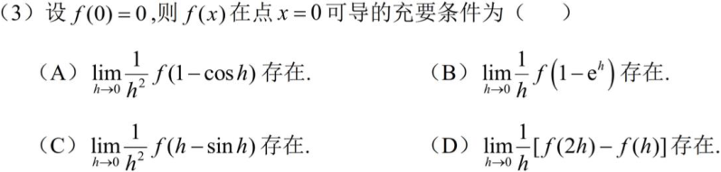
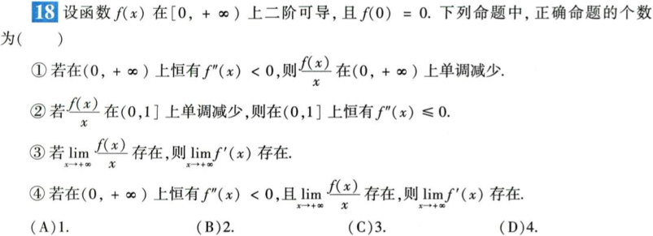

# 一元微分

> 来源：大观《一元微分做题本》PDF 目录 · 完整结构
> 澄潇宇、一只羊 & 南门朔

话说在前,不好做就用导数定义

## A.导数概念

### 1.基本概念题

上限可能是负值

定义式子一定要记住

### 2.--微分概念

$\Delta y = dy + o(\Delta x) = A\Delta x + o(\Delta x)$

三角x和dx相等，从题目中找到他们就行了

### 3.极限与导数

没说可导不能用洛必达

已知分子推分母，一般不能拆开，会有趋近无穷的项，用等价无穷小只留下分母的x

#### a)已知极限求导数

##### (1)求一阶导

还是用上面的构造，在球的函数值的时候要是0直接减去，凑出分母的对应的dx形式

##### (2)求高阶导

直接泰勒展开对比系数

有原函数，一阶导数，二阶导数的可以利用泰勒

#### b)已知极限推极值拐点(重要)

保号性

先写出来对应位置的导数的形式，然后想办法配凑

如果不成功，直接利用保号性，寻找邻域内的较大或者较小值

#### c)极限存在与导数存在（超级重要）

##### 用定义证明

必须从两边逼近，比如这里的1-cosh只可能是0+不是是负数所以不行，偶数次的一样只有一边能逼近，对与d选项不能直接拆开因为导数不一定存在（不能两动点），这里c的哈纳树可能是一个有界变化的函数乘以无穷小函数就趋于0

##### 包含绝对值的

###### 连续性的关系

###### 可导性的关系

**只要绝对值可导，该点必可导**

到0这个位置就比较危险，要想回推必须保证导数为0平的

超级重要的母题

#### d)洛必达法则使用（超级重要）

**如果曲线最后越来越贴近一条水平线，那么切线斜率一定越来越趋于某个值。**这是**不一定成立**的。虽然点越来越靠近水平线，但曲线仍然可以不停地上下抖动，只不过振幅越来越小，所以切线斜率可以一直剧烈变化，没有极限。

若最后斜率趋于 1，曲线越来越像y=x,y=x,y=x，它会一直向上走，不可能趋于某个固定高度。所以：**斜率稳定，只说明曲线越来越像一条直线，并不说明它停在某个高度。**

[【26考研数学 | 经典错误系列#2】一个视频扫清洛必达雷区！_哔哩哔哩_bilibili](https://www.bilibili.com/video/BV19yZ2YrEXa/?spm_id_from=0.0.search-card.all.click&vd_source=e97c43b522053bd08aa954ad373fe7ae)

1.后验性：算出来了能说明存在，算不出来说明洛必达法则失效，不能说明原极限存在或不存在

2.要求：满足去心邻域可导（分母导数不为0），未定式

3.对于 ∞∞型未定式，大部分变限积分在分母上：

> ✅ **只需验证分母趋于 ∞，分子不需要验证，可以直接洛必达。**

4.二阶可导 ≠ 二阶导函数极限存在所以只能用一次洛必达

转换用导数定义来做

如果二阶导数连续

5.不能对数列用，只能对函数用，海涅定理说明一下就行了

几何意义，说明越靠近 a，切线越来越陡。

而普通导数定义为必须是一个**有限斜率**。

### 4.某点的可导问题

#### a)绝对值相关

##### (1)f与|f|可导性的关系

###### 乘积解决不可导点

不可导的图像不就是有个小角嘛，乘个0就相当于把这个角压扁了，就可导了

###### n阶可导

###### 低次幂的不可导点

对于比如根号x这种，x等于0时候特别陡峭，导数无穷大

###### 失效

绝对值里面是函数

用定义证，左右导数相等

##### (2)判断不可导点的个数

###### 细致考虑

也要考虑这个低次幂，这里分析的时候还是带入数值，x=0附近其余因子都不为零，可看成$f(x)∼C∣x∣$ 但是你要是带入-2的时候乘起来幂次变得比1大了可以导了

##### (3)求可导的最高阶数

##### (4)两个函数乘积

从数值这边推彼得，直接用定义式验证存在，从已知可导看满不满足，用反证法找矛盾

#### b)研究具体函数在某点的导数

##### (1)不分段函数

**若函数在某点的左导数和右导数都存在但不相等，则该函数在该点不可导，但仍连续。**

如果左导数存在，说明：从左边无限靠近这个点时，函数的变化一直很正常，没有突然跳一下，也没有乱抖，否则就谈不上一个确定的斜率。

同样，右导数存在，也说明：从右边靠近这个点时，变化也是平稳的。

所以，**左右两边都能平稳地走到这个点**，自然就意味着函数值不会突然断开或跳跃，也就是**连续**。

##### (2)分段函数

判断不出来的回归到导数定义看看左导数是不是等于右导数
$$
\text{连续并不要求附近的点取到该值，只要求}
\lim_{x\to x_0}f(x)=f(x_0).
\text{例如，}
f(x)=
\begin{cases}
x,&x>0,\\
0,&x=0,
\end{cases}
\quad
(\forall x>0)\,f(x)>0,
\text{但}
\lim_{x\to0^+}f(x)=0=f(0),
\text{故 }f(x)\text{ 在 }x=0\text{ 处连续。}
$$

###### 三角分段函数

它由两个因素决定：

- sin⁡(1/xβ)\sin(1/x^\beta)sin(1/xβ)：负责**左右快速振荡**
- xαx^\alphaxα：负责**把振荡的幅度压缩**

可以想象成一条越来越密集的波浪曲线靠近原点。

最多只能导一次

##### (3)含绝对值的参数方程

分段讨论,记住下面的求导公式

把函数转化为fx然后正常做,可以利用导数定义,一般求的点的值都是0可以直接减去凑定义

#### c)研究抽象函数在某点的导数

还是定义还是定义

d选项切线可以是垂直于x轴的

## B.导数计算

### 1.乘积求导

前面一块后面一块(找到带入可以等于0的那一项),,,,或者使用定义

### 2.复合函数求导

不好做用定义

### 3.隐函数求导

两端求导

### 4.反函数求导

用一阶导的导数再去除以一阶导

二阶导是负号

### 5.参数方程求导

二阶导

注意这里又除了,底下是三次方

也可以一阶导函数对t求导,在除以x对t求导

### 6.幂指函数求导

题目抄一遍,乘以脑袋倍的ln肚子导一遍

### 7.多个因式积商开方

乘积取对数

### 8.高阶导(三大公式,泰勒展开,牛赖公式,有理函数导数公式)

在做不出来的时候试一试,可能会出现导数和她原函数的关系

做的时候把不相关的直接去掉比如这里的后面部分

注意这里第一项是原函数

注意这里是在0处展开

2^次方转化成e的指数就可以展开了

等比数列求和的特勒公式有时候也会好用

#### a)明显奇偶性

#### b)有理函数

记住公式就行

**符号部分**：(−1)n—— 每求一次导，符号翻转一次，奇次导为负，偶次导为正。

**阶乘部分**：n!—— 第 n 阶导数会出现 n 的阶乘（源于连乘链式法则）。

**系数部分**：an—— 因为每次对 ax+b求导都会带出一个 a，n 次就是 an。这里是这里是这里是系数 

#### c)对数相关

#### d)乘积高阶导

#### e)罕见函数

#### f)分段函数

#### g)变限积分

#### h)有规律

一个好题

## C.导数应用

### 1.切法线

#### a)普通曲线

#### b)隐函数表示的曲线

#### c)参数方程表示的曲线

#### d)极坐标表示的曲线

#### e)未给出表达式

#### f)切线在x轴上的截距

#### g)其他

### 2.渐近线

#### a)斜渐近线(可提取)

##### (1)直接给出

##### (2)有理分式

##### (3)含对数

##### (4)含指数

##### (5)含根号

#### b)含对数

#### c)含根式

#### d)含幂/指函数

#### e)隐函数

直接转化求x和y的线性关系

#### f)参数方程

一样的还是用定义

#### g)极坐标

#### h)反函数

#### i)其他

### 3.曲率

上面是绝对值，下面根号也控制了

这里是x对y求导，x当老大了，x=f(y)

不会了可以画图辅助

#### a)概念题

#### b)最小曲率(半径)

#### c)曲率圆

#### d)曲率(半径)

#### e)其他

### 4.极最拐（刷题少补充刷题）

#### a)极值

##### (1)单调性

##### (2)极值概念题

##### (3)求极值

#### b)最值

##### (1)普通函数

##### (2)以积分给出的函数最值

#### c)拐点

##### (1)凹凸性

##### (2)拐点概念题

##### (3)求拐点(个数)

这里的是平方

##### (4)判断拐点

##### (5)高次幂乘积拐点

##### (6)微分方程解的拐点

##### (7)参数方程凹凸性及拐点

##### (8)已知拐点求参数

#### d)综合计算

### 5.方程根/曲线交点/函数零点

#### a)求个数

#### b)已知个数确定参数

#### c)含参讨论

#### d)方程根的极限

#### e)其他

### 6.不等式

#### a)概念题

#### b)证明具体不等式

#### c)其他

### 7.物理应用

## D.微分中值定理

### 1.小题

#### a)泰勒多项式

#### b)其他

### 2.大题(见证明题保分专题)
