# 反常积分

> 来源：大观《反常积分题库》目录 · 完整结构
> 澄潇宇、一只羊 & 南门朔

---

## A. 审敛

不能一飞冲天了↑

### 无穷积分

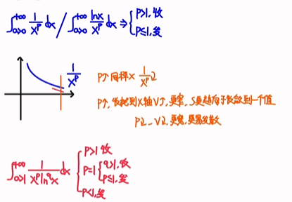

无穷积分这里注意下面p等于1时候凑微分转化成了上面的情况，注意一下积分下限

此时0处变成了无穷积分

越大趋于0的速度越快越收敛

等于1总是在发散的时候取到

### 瑕积分

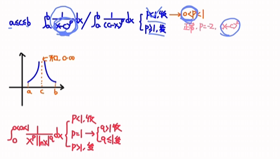

越小趋于无穷的速度越慢越收敛

这里参数p如果小于0的话也收敛所以没事

等于1总是在发散的时候取到

### 转化成上面的情况

#### 单lnx分母的

变成上面的x的0次方的形式

#### 单lnx的

变成上面的x的0次方ln的-p次方形式

### 小总结

中间的一样，其他的跟随，看清系数

### 比较申敛法

区间内**被积函数非负**，负数的话转化为绝对值

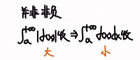

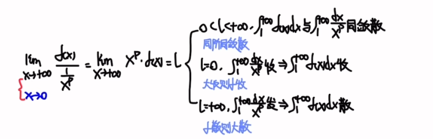

在趋于无穷的时候得无穷下面就大，趋于0的时候得0下面就大

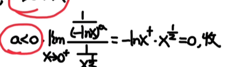

比较审敛法具体使用

1.只能一边趋进的时候用，不然要拆为两个，都收敛就收敛，分别按照无穷积分和瑕积分做

2.只需要趋近一侧的极限(另一侧不在我们的区间内)

3.千万千万要记住**无穷小时去掉高阶**，无穷大时候忽略低阶，比如这里1比x阶大，去掉x

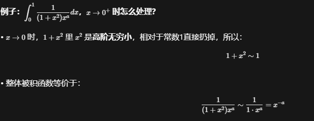

例题

能带入就带入，经典的因式分解再代入

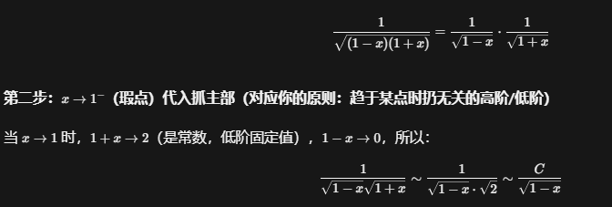

无穷侧不为0，面积一直增加

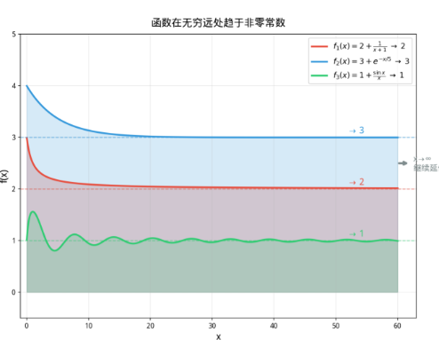

指数乘三角直接算

## B. 敛散性和参数的关系

### 1. 纯幂函数

特例取1/x如果可以的话就偏移使他符合条件

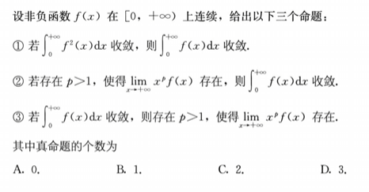

1. 反常积分只看总面积，不管函数局部行为；函数可以出现无限多个高尖峰，只要峰足够窄，总面积仍然可以收敛。
2. 所以“积分收敛 ⇒ 函数一定规律”（有极限、按某速度衰减等）通常是假；而“函数被某个可积函数压住 ⇒ 积分收敛”通常是真。

### 2. 与ln有关

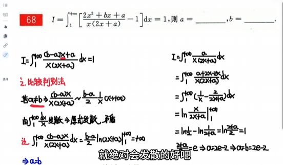

抓大头判断参数情况，这里全为0

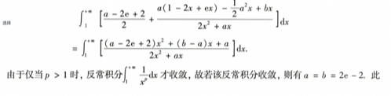

### 3. 含参有理式

### 4. 三角相关

只能在0处展开

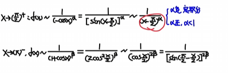

### 5. 其他