# 后记

> 做题里反复踩坑、又容易忘的提醒。按专题归类，方便考前扫一眼。

---

## 1. 构造与凑微分

- **构造函数**：
  - 形如「原函数减导数」→ 可乘 $e^{-x}$（或 $e^{x}$），把结构凑成全导数。
  - 看见 $f(x)\,f'(x)$ → 立刻写成 $\dfrac12\bigl(f(x)^2\bigr)'$。

- **表格法分部**：本质是算 $\int u\,v\,dx$。  
  只需把 $u$、$v$ 写进表格按规则乘加；**不必**再额外「用线把函数硬凑进微分里」。

- **变限积分**（三种常用处理）：
  1. **直接做**：对变限求导（微积分基本定理），或极限型用洛必达。
  2. **构造 + 分部**：先构造合适函数，再分部把积分挪走或降阶。
  3. **泰勒展开被积函数内部**，再逐项积分 / 取极限。

  正反都能凑：
  - **正着**：变限 / 定积分里，把另一个搭配函数凑进微分，做分部积分；
  - **逆着**：把一个普通函数直接凑进微分，写成「某个变限积分」的形式（或认成它的导数）。

---

## 2. 积分计算：认型与换元

**总路线：**

1. **先化简**（坟墓有什么分子拆什么一定要记得先干着一部，有时候不敢这部没办法处理了）

2. 化简不动再 **换元**（三角换元常用 $\tan$、$\sec$）

3. $\tan$、$\sec$ 积不出来时 → **拆成 $\sin$、$\cos$** 再降幂 / 凑微分

   注意：$\sec$ 换元时，常对应 **下限 $1$、上限 $+\infty$**（如 $x=\sec\theta$，$\theta:0\to\frac{\pi}{2}^-$）

   最后记得换回去，用三角形辅助计算

**区间技巧：**

- 积分限是 $[0,\pi]$，或下限不是 $0$、看起来很怪 → **立刻变到对称区间**
- 出现 **$3/2$ 次方**（如 $(a^2\pm x^2)^{3/2}$）→ 优先试 **$\sec$ 换元**（或 $\tan$）
- 公式里三角函数区间常从 $0$ 到 $\pi$；形如 $\displaystyle\int_0^{\pi} x\,f(\sin x)\,dx$ 一类，**上限是 $\pi$**

**三角定积分小结论：**

- $\displaystyle\int_0^{2\pi} t\sin t\,dt = 1$
- 几何直觉：一个扇形面积 $2$，比 $\pi\cdot 1$ 更小

记得 **二倍角公式**（降幂、拆积）。遇到诡异高次三角、或内部表达式拧巴时，优先降幂 / 化积，不要硬积。

**消 $1$ 作用：**

- $1+\cos x$ → 用 **二倍角**：$1+\cos x=2\cos^2\dfrac{x}{2}$
- $1+\sin x$ → 用 **半角 / 辅助变形**（常写成 $\bigl(\sin\frac{x}{2}+\cos\frac{x}{2}\bigr)^2$ 一类），不要硬套成 $1+\cos$ 那套
- 用 $\sin x\cos x$ 凑回去 $\sin 2x$

---

## 3. 原函数存在性（选择/判断）

若 $f$ 有原函数 $F$，则 $F$ 可导 ⇒ $F$ 连续 ⇒ $F$ 也必有原函数。

因此：**两个都有原函数的函数，它们的和也一定有原函数**（和的积分 = 各自原函数之和）。  
选项里出现「和是否有原函数」——这类叙述通常是对的。

---

## 4. 变上限积分 $F(x)=\int_a^x f(t)\,dt$

### ① 连续性

若 $f$ 在 $[a,b]$ 上 **可积**（不必连续），则  
$F(x)=\displaystyle\int_a^x f(t)\,dt$ 在 $[a,b]$ 上 **一定连续**。

### ② 可导性（$f$ 除 $x_0$ 外连续）

| $f$ 在 $x_0$ 的情况 | $F$ 在 $x_0$ | 导数 |
|---------------------|--------------|------|
| 连续 | 可导 | $F'(x_0)=f(x_0)$ |
| 可去间断 | 仍可导 | $F'(x_0)=\displaystyle\lim_{x\to x_0}f(x)$ |
| 跳跃间断 | **不可导** | 左导 $=f$ 的左极限，右导 $=f$ 的右极限 |

$$
F'_-(x_0)=\lim_{x\to x_0^-}f(x),\qquad
F'_+(x_0)=\lim_{x\to x_0^+}f(x)
$$

**可去间断为何仍可导：**  
导数反映的是邻域内的**变化趋势**。单点取值「空了」，但左右趋势一致、极限存在，积分函数仍可导，相当于导数把这个洞补上了。

---

## 5. 大题心态与积分不等式

- **计算量大**：相信正确方法；很多题就是 **力大砖飞**。  
  通法写了很久仍算不出 → 多半 **不是硬算题**，换构造 / 对称 / 估值。

- **积分不等式** 三条路：
  1. **构造函数再求导**（单调性 / 极值），通常上限当作自变量，注意这里一定要**可导**

  2. **泰勒展开**（控余项）  
     参考：[李林 880 精讲相关片段](https://www.bilibili.com/video/BV1UwLG6WET6/?p=33&t=2719)

  3. **排序 / 切比雪夫积分不等式**  
     若 $f,g$ 在 $[a,b]$ 上**同增**（或同减），则：
     $$
     \frac{1}{b-a}\int_a^b f(x)g(x)\,dx
     \ge
     \left(\frac{1}{b-a}\int_a^b f(x)\,dx\right)
     \left(\frac{1}{b-a}\int_a^b g(x)\,dx\right)
     $$

- 构造后若还剩一个积分：用 **积分中值定理** 破成函数值。  
  注意：积分中值是 $\displaystyle\int_a^b f=f(\xi)(b-a)$，**不必再求导**，直接落到原来 $f$ 的某个值。

- **Hermite–Hadamard**（$f$ 凸；凹则反向）——两边是琴生，中间是积分：
  $$
  f\Bigl(\frac{a+b}{2}\Bigr)
  \le
  \frac{1}{b-a}\int_a^b f(x)\,dx
  \le
  \frac{f(a)+f(b)}{2}
  $$


---

## 6. 反常积分

- 很多敛散性结论默认 **从 $0$ 到 $+\infty$**（或瑕点在 $0$）。
- **下限是 $1$ 而不是 $0$** 时，不能照搬 $0$ 处等价。
- 操作：用 **等价无穷小**；需要时再 **比较放缩**；能代入的极限先代入，看主部是谁。

---

## 7. 极坐标 / 弧长 / 旋转体

- **极坐标面积**：$\displaystyle A=\frac12\int_{\alpha}^{\beta} r^2\,d\theta$（必须是 **$r^2$**）。
- 以 **$r$ 为自变量**、$\theta=f(r)$ 时，弧长里会出现 **$r^2\bigl(f'(r)\bigr)^2$**（比直角坐标多了这个 $r^2$ 因子）：

$$
L=\int_{r_1}^{r_2}\sqrt{\,1+r^2\bigl(f'(r)\bigr)^2\,}\;dr
$$

- **旋转体**（侧面积等）：积分里要乘 **弧微元** $ds$，也就是平常平面弧长里的那一项  
  $\displaystyle ds=\sqrt{1+(y')^2}\,dx$（或对 $x=x(y)$ 写成 $\sqrt{1+(x')^2}\,dy$）。  
- **古尔丁定理**（Pappus）：平面图形绕不穿过内部的轴旋转时，  
  **体积 $=$ 面积 × 重心走过的路程**；  
  **侧面积 $=$ 弧长 × 重心走过的路程**。  
  （绕定轴转一圈时，路程 $=2\pi\times$ 重心到轴的距离。）
- 长度→面积→体积

---

## 8. 黎曼和与极限

- 黎曼和写不出标准型 → **夹逼**；常与黎曼和联用。  
  放缩时尽量 **只动分子或只动分母**，两边一起猛放容易「放飞」估死。

- 极限题：放缩，或凑黎曼和——把 $1,2,3,\ldots$ 先写成 $i$(就要求我们把x除到下面凑成x/x的形式只保留数)，再化成 $\dfrac{i}{n}$（或 $(a-b)\dfrac{i}{n}$ 一类）。

  这里的 $a-b$ 很重要

---

## 9. 摆线 / 双纽线

- **摆线**与 $x$ 轴交点间距一类结论里，常出现 **$x$ 方向 $2a\pi$**（一个拱的水平跨度）。

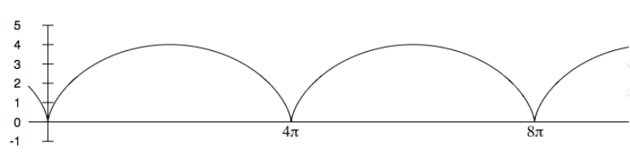

- **双纽线**（伯努利）：$r^{2}=a^{2}\cos 2\theta$（或 $(x^{2}+y^{2})^{2}=a^{2}(x^{2}-y^{2})$）。

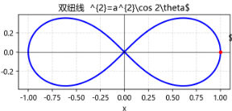

---

## 10. 导数

- 对于一个导数，可以先写出它的 **定义式**：
  $$
  f'(x_0)=\lim_{x\to x_0}\frac{f(x)-f(x_0)}{x-x_0}
  $$
  很多题把这个形式直接写出来就能往下接，不一定先把 $f'$ 的封闭式求出来。

- 题目给 **大写** $F(x)$（或 $S(x)$）**等于一个变限积分** → **立刻求导**  
  若 $F(x)=\displaystyle\int_a^x g(t)\,dt$，则 $F'(x)=g(x)$。

- 已知 $f$ 可导，极限里若出现「长得像导数定义」、且含有 $f(x^2)$：  
  令 $g(x)=f(x^2)$，则该极限就是 $g$ 的导数定义：
  $$
  g'(x)=\lim_{\Delta x\to 0}\frac{f\bigl((x+\Delta x)^2\bigr)-f(x^2)}{\Delta x}
  $$
  而 $g'(x)=\dfrac{d}{dx}f(x^2)=2x\,f'(x^2)$（**不是** $2x\cdot f'(x)$；撇作用在 $f$ 上，自变量仍是 $x^2$）。


## 二重积分

**关键就是找好积分区域（可以用点和x代替排除），做对称的时候也要细心，还有带入积分函数，带入上下限的时候，括号和减号的时候，**可以多花时间一定要确保对了，都很简单主要是**仔细**

慢就是快


列长式别列等式，乘开算不容易错

右根号下x方y方肯定极坐标


对出口显化图只能画x z y的第一个象限 

先把图形用虚线描点 

以**平面截球面得椭圆的通用逻辑**举例：

1. 两个确定点：①交线和底面（z=0，也就是原投影圆/赤道的）交点、②交线最高点（顶面端点）
2. 已知交线所有点的水平投影落在原球面的水平投影圆上 → 空间交线就是这个投影圆被平面拉伸后的结果，必然是**椭圆**（平面截球的所有交线要么是圆/椭圆/点/直线，斜截就是椭圆）。

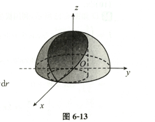


被移动的圆必使用雅可比，使得上线变成常熟

雅可比的代换后的取值，要带入所有x和y的方程中不然容易错

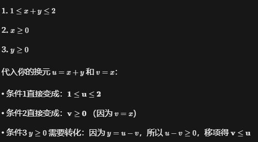

这里要注意的是，j是绝对值，i一定要记住，错了好多次了，平移的时候无额外系数


别死盯着北极函数，北极函数的块与块之间的关系也要注意

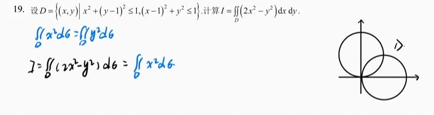

画线分开积分区域

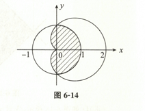

将迷宫式

你说的应该是**三角降幂公式**（也叫**降次公式**），在二重积分、傅里叶级数里非常常用。给你整理得清晰一点：

------

## 一、核心降幂公式（由二倍角公式推来）

### 1️⃣ 余弦降幂（最常用）

```
cos2θ=21+cos2θ
```

### 2️⃣ 正弦降幂

```
sin2θ=21−cos2θ
```


积分函数分段积分区域

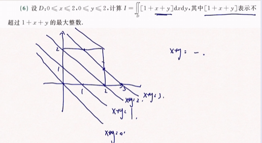


y+1=1/(x+1)平移的双曲线


在 xy 平面上有圆/扇形/环形特征，

1.如果积分的上下限特别麻烦比如根号下a-r方这种，可以考虑先2后1分，也有可能不用分段

每个面上先积分函数值一次

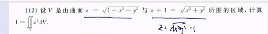


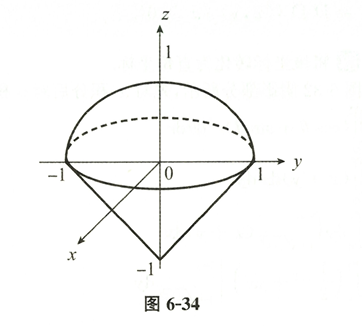

2.如果上下限很麻烦（或者上下限分段），，用柱坐标，先1后2，投影在一个区域内，避免了先2后1的分段

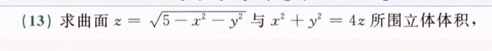

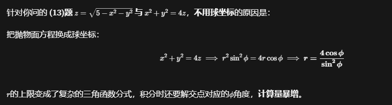

心形线

参数方程中先写出直角坐标系中面积的表达式，y的上限用y(x)表示，然后带入就行了

积分内部函数好算，尝试用积分中值定理，函数乘以面积

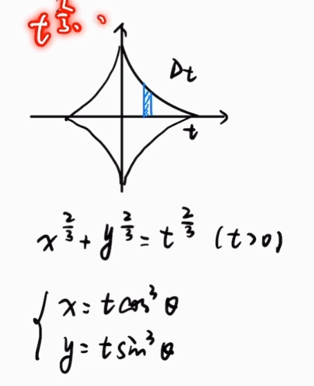

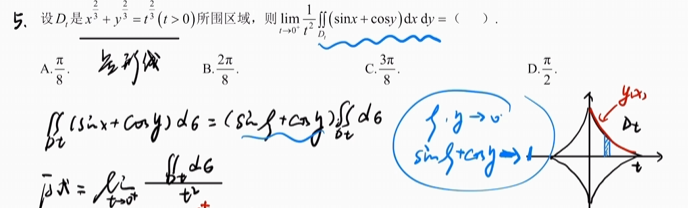


简单来说：**碰到尖尖的锥体和圆圆的球体，球坐标能把它们切成完美的切片；碰到直直的筒子和抛物线碗，柱坐标才好用。**

还是得看具体的区域表达式好不好画

看成极轴穿球面

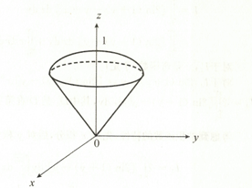


凑对称和反对称和半对称（sinx平方+cosy平方）

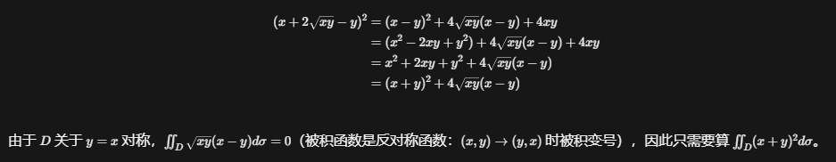

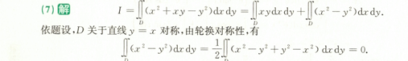


积分函数，先用低次幂的

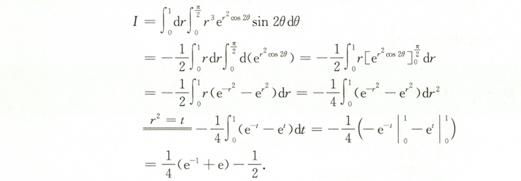


有限增量定理

左端点的值加上小于1倍的区间长度

被夹住的式子


积分等式常数直接积分，变成面积


绝对值变换区间

把v2换成v-v1

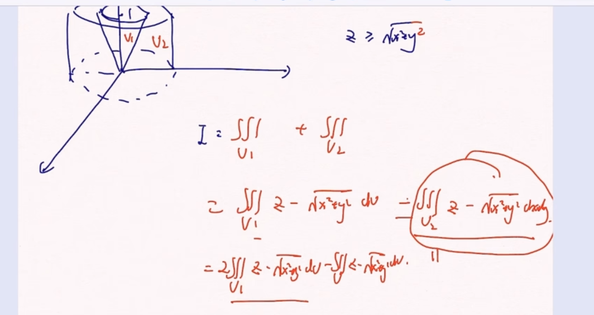


## 微分方程

记住一阶其次和非齐次公式

记住二阶齐次和非齐次，左端式子对应的通解结构和右端式子的特解结构（可能是合并了的），必要时候带入验证

微分算子法计算特解


要表明c是任意常数还是正数有时候很阴，左边是恒正的

容易注意不到x和y的取值

关注虚数的情况，±i这里a是0，b是1

带入常数c的时候容易化简错误

最后一步带入数值的时候，反而更容易出错

复合函数求导数很容易忘记里面的导数


看到f(x+y)和积分上下限a+x，a，分别用导数定义拆开或者区间变化对出现少的位置求导，或者分别求导带入特值


关于解的极限情况，从r的正负可以分辨出来，用韦达定理讨论


记住绝对值开根号个能是正或者负


观察全微分形式，同样的是全微分就满足混合偏导相等，很多题都是硬算


要注意到换元后的字母，尽量换元分开写比较清楚，一定要记住后面的求的是跟这个代换之后的的关系


对于形如上线无穷下限0的y积分，把y用等式替换成导数，然后就可以凑成原函数了


若做变换因变量的代换，导数互为倒数


### 1. 第一种情况：方程**不显含未知函数 y**

第一题中求导后得到：1+(y′)2=y′′，也就是方程里只有 y′ 和 y′′，完全没有 y 本身。

此时令 y′=p，那么 y′′=dxdp，直接就把二阶方程变成了关于 p(x) 的**一阶方程**，不需要转换变量。

这类形式：F(x,y′,y′′)=0，就用 y′=p(x), y′′=p′。

------

### 2. 第二种情况：方程**不显含自变量 x**

第二题的方程是 yy′′+2(k−1)(y′)2=0，观察发现整个式子只有 y、y′、y′′，完全没有出现自变量 x。

此时如果用 y′′=p′，会剩下 y 没法处理；所以改用链式法则把导数转为对 y 求导：

```
y′=p,y′′=dxd(y′)=dydp⋅dxdy=p⋅dydp
```

这样代回原方程后，x 就被消掉了，变成关于 p(y) 的一阶方程，可以直接分离变量用 y 积分。

这类形式：F(y,y′,y′′)=0，就用 y′=p, y′′=pdydp。


结合二重积分的，顶死上线，变区间或交换积分次序，注意奇偶和对称性


对于几何应用的题，用Y和X代替原来y和x的地方，长度要注意有绝对值，三角形面积就用底乘高0.5


物理应用就列等式然后变成微分形式再积分


## 几何

prj是投影


平面束方程，单参数形式是不包含自己的，所以还要验证，如果只解出来一个值，那有可能漏解


点到直线距离公式，分母不算常数，点到直线距离公式，用叉乘推出


叉乘求法向量，按第一行展开，记得要有符号


点法式方程，有等号做等式可以写成化成普通形式


已知平面方程 Ax+By+Cz+D=0

法向量直接读系数：

```
n=(A,B,C)
```

比如平面 2x−3y+z−5=0，法向量就是 (2,−3,1)。


平行四滨兴面积就是叉乘取模


两直线之间距离

转成直线和面

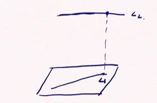


直线在面上的投影，转化成面与面的交点

直线方程可以用交面的联立代表

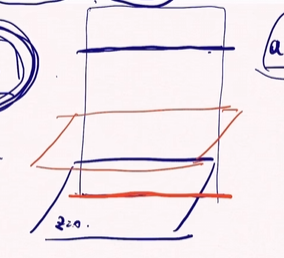


与两个直线都垂直相交的线，用两个面确定一个线

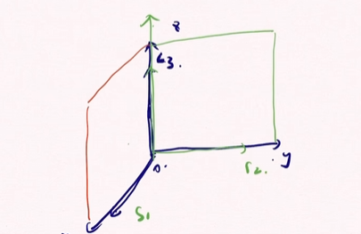


旋转曲面绕z就z不变，别的变成正负根号下x方+y方

按下面的格式，x0对应x的关系

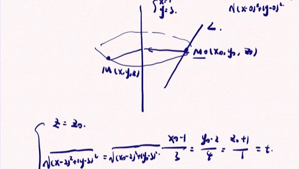


投影方程消去取圆柱的截面


和自己叉乘数值为0，交换先后添负号


平面束方程，


极限与连续

**渐近线**：某一侧（如 $x\to+\infty$）若已有水平渐近线，则该侧无斜渐近线；但仍需另看另一侧（如 $x\to-\infty$）。两侧要分开判断。

分子比分母可以把分母展开

**$\dfrac{1}{1-x}$**


在等价无穷小的时候

对应到这个题的第一步：

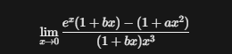

```
x→0lim(1+bx)x3ex(1+bx)−(1+ax2)
```

因为 (1+bx) 是分子**加减结构里的组成部分**（ex和(1+bx)相乘后，结果里有 bx⋅ex 的项，这部分会产生 bx、bx2 等低阶项，直接影响分子的x和x2系数），你直接把它换成常数1，等于丢掉了所有带b的低阶项，最后求出来的b根本不存在/完全错误。


易错点，关于arctan1/x和e的-x次方和tanx两边极限不一样

对于积分在分子上的时候，奇函数对称区间就是0，或者0区间也是0

取整函数两边的也不一样，-1和0


0*无穷的常用到代换（记得要有e为底数，脑袋，肚子减1），无穷见无穷用提公因式


针对幂指函数，可能用**到代换**或者等价无穷小**a的x次方-1等于xlna**，很常见必然用


出现参数或者无法化简用拉格朗日破开

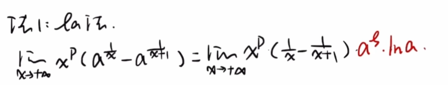


e的x次方等于e的a次方乘以e的x-a此番注意这里是减号！！！

施托克斯推论

$$\lim_{n \to \infty} \sqrt[n]{x_n} = \lim_{n \to \infty} \frac{x_{n+1}}{x_n} \quad (x_n > 0,\ \text{右端极限存在})$$


遇到e的x次方减去1，吧1变成e的0次方用中值定理