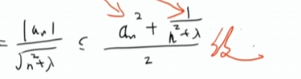
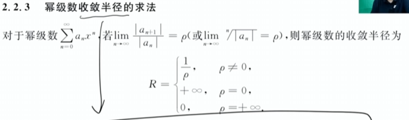
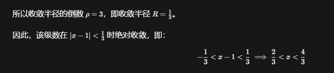
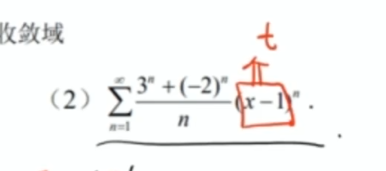
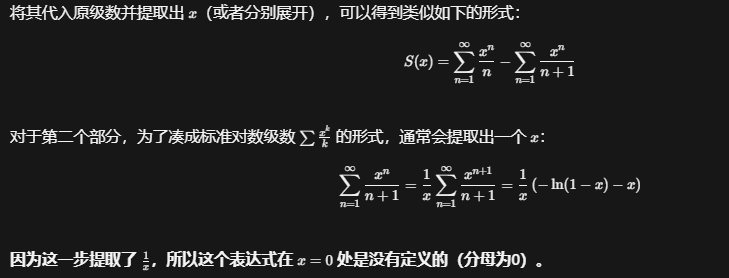
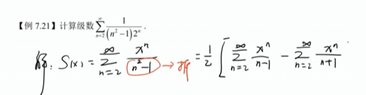
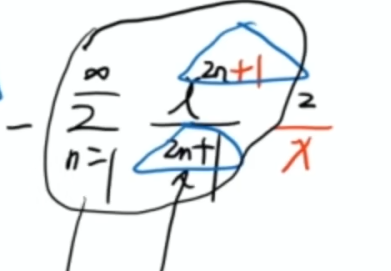
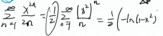
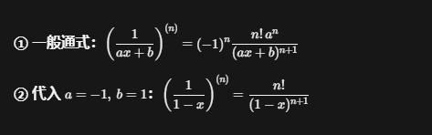

# 第七讲：无穷级数（基础版笔记）

> 来源：视频字幕整理  
> 本章分值约 **17 分**（大题约 12 分 + 选择题约 5 分），是考研高数的**重中之重**。

---

## 本能反应

见到 **$x_{n+1} - x_n$**（相邻两项做差、再求和）→ 本能想到**级数收敛**：用**定义法**，写部分和 $S_n$，裂项相消后看极限是否存在。

**根值法里的多项式极限**：对任意多项式 $P(n)$，都有

$$\lim_{n\to\infty}\sqrt[n]{P(n)} = 1$$

例：$\displaystyle\lim_{n\to\infty}\sqrt[n]{n(2n+1)} = 1$（根值法求收敛半径时直接用，不必再算）。

---

## 判敛优先级（做题总纲）

### 第一优先级：永远先试「绝对收敛」

只要题目让你判断级数 $\sum u_n$ 的敛散性，**不管它是不是交错的**，第一步永远是：

令 $v_n = |u_n|$，判断 $\sum v_n$ 是否收敛。

**为什么？** 正项级数判别工具多（比较、比值、根值、积分判别法等），好算、好证，成功率最高。一旦绝对收敛，原级数必收敛，直接搞定，不用再管正负号。

**什么时候绝对收敛好用？** 通项含以下特征时，直接往绝对收敛上靠：

| 特征 | 方法 |
|------|------|
| 含 $n$ 次方、阶乘：$a^n,\,n!,\,n^n$ | 根值法 / 比值法 |
| 含三角、对数：$|\sin n|,\,|\ln(1+\frac{1}{n})|$ | 比较判别法（放缩） |
| 带绝对值符号，或明显为正 | 直接当正项级数处理 |

> **结论**：只要能用比较、比值、根值法算出来的，一律归为**绝对收敛**。

### 第二优先级：绝对收敛失败，才用「莱布尼茨」

当 $\sum |u_n|$ **发散**时，才考虑莱布尼茨。

> 莱布尼茨只适用于**交错级数** $\sum(-1)^n u_n$ 或 $\sum(-1)^{n-1}u_n$（$u_n>0$）。

此时需验证**条件收敛**的两条：
1. **单调性**：$u_n \geq u_{n+1}$
2. **极限为零**：$\lim\limits_{n\to\infty} u_n = 0$

**什么时候必须用莱布尼茨？** 当 $u_n$ 衰减很慢，绝对值级数发散，但正负抵消使总和收敛时。典型标志：

- 分母只有 $n$ 的幂次（无指数、无阶乘）：
  - 经典：$\sum\frac{(-1)^n}{n}$（调和级数发散，交错调和级数收敛）
  - 变体：$\sum\frac{(-1)^n}{\sqrt{n}}$，$\sum\frac{(-1)^n\ln n}{n}$
- 题目提示「条件收敛」，或 $\lim|u_n|=0$ 但比值/根值法得 $\rho=1$（正项判别法失效）

---

## 均值不等式



## 一、知识体系总览

无穷级数分为两大类：

| 类别 | 特点 |
|------|------|
| **数项级数** | 通项不含 $x$，研究敛散性 |
| **幂级数** | 含 $x^n$，研究收敛域与和函数 |

---

## 二、数项级数

### 2.1 基本概念

**定义**：给定数列 $\{u_n\}$，部分和 $S_n = u_1 + u_2 + \cdots + u_n$。

- 若 $\lim\limits_{n\to\infty} S_n = S$ 存在 → 级数**收敛**，和为 $S$
- 若极限不存在 → 级数**发散**

### 2.2 级数的六大性质

| 序号 | 性质 | 要点 |
|------|------|------|
| 1 | 常数倍 | $\sum ku_n$ 与 $\sum u_n$ 同敛散 |
| 2 | 加减法 | 收敛 ± 收敛 → 收敛；收敛 ± 发散 → 发散 |
| 3 | 发散 ± 发散 | **不确定**（可能收敛也可能发散） |
| 4 | 改变有限项 | **不影响**敛散性（有限项之和为常数） |
| 5 | 加括号 | 收敛 → 加括号仍收敛；**反之不成立** |
| 6 | ★ 必要条件 | 收敛 → $u_n \to 0$；这个超级超级超级超级超级超级常用，给你了某个收敛 |

### 2.3 两个典型级数（必记）

**（1）等比级数**

$$
\sum_{n=0}^{\infty} aq^n = \begin{cases}
\dfrac{a}{1-q}, & |q| < 1 \text{（收敛）} \\[6pt]
\text{发散}, & |q| \geq 1
\end{cases}
$$

**（2）p 级数**

$$
\sum_{n=1}^{\infty}\frac{1}{n^p} \begin{cases}
\text{收敛}, & p > 1 \\[4pt]
\text{发散}, & p \leq 1
\end{cases}
$$

- $p=1$ 时称为**调和级数**，发散
- 阶数越高越收敛，阶数越低越发散

---

## 三、正项级数

### 3.1 核心特点

$u_n \geq 0 \Rightarrow S_n$ **单调递增**。

→ 正项级数只需证明 $S_n$ 有界，不必求出具体和。

### 3.2 五种判别法

| 方法 | 适用场景 | 核心公式 |
|------|----------|----------|
| **比较判别法** | 抽象级数、放缩 | $0 \leq u_n \leq v_n$：大敛则小敛，小散则大散 |
| **比较判别法（极限形式）** | sin/cos/ln 等，配合泰勒展开 | $\lim\frac{u_n}{v_n}=L\in(0,+\infty)$ → 同敛散 |
| **比值法**（考的少） | 含**阶乘**（这里是以1分界） | $\rho = \lim\frac{u_{n+1}}{u_n}$：$\rho<1$ 敛，$>1$ 散，$=1$ 不定 |
| **根值法** | 含 $n$ 次幂（干掉n次幂） | $\rho = \lim\sqrt[n]{|u_n|}$：$\rho<1$ 敛，$>1$ 散，$=1$ 不定 |
| **积分判别法** | 强化阶段讲 | 基础阶段了解即可 |

常用等价无穷小辅助

$u_n = \left( \frac{n}{n+1} \right)^n, \quad \lim_{n \to \infty} u_n = \lim_{n \to \infty} \frac{1}{\left( 1 + \frac{1}{n} \right)^n} = \frac{1}{e}$

分情况讨论ρ的时候等于1再重新算，可以用通项极限趋近于0

---

## 四、交错级数

### 4.1 定义

形如 $\sum(-1)^{n-1}u_n$ 或 $\sum(-1)^n u_n$（$u_n > 0$），正负交替。

### 4.2 莱布尼茨准则

对于交错级数 $\displaystyle\sum_{n=1}^{\infty}(-1)^{n-1}u_n$（$u_n>0$），若同时满足：
1. **单调性**：$u_{n+1}\leq u_n$ 对某 $N$ 及一切 $n\geq N$ 成立（从某项起单调递减，$u_n$ 不带正负号）
2. **极限为 0**：$\displaystyle\lim_{n\to\infty}u_n=0$

→ 级数收敛，且 $S\leq u_1$，余项 $|R_n|\leq u_{n+1}$。

**判断单调性技巧**：构造连续函数 $f(x)$，对 $f(x)$ 求导判断符号。

**缺 $(-1)^n$ 的处理**：人为添加 $n\pi$，利用 $\sin(\sqrt{n^2+a^2}-n\pi)$ 等变形。

**典型不适用 → 改判绝对收敛**（例 7.9）：$\displaystyle\sum_{n=1}^{\infty}(-1)^n\frac{|a_n|}{\sqrt{n^2+\lambda}}$，已知 $\sum a_n^2$ 收敛。

- 无法保证 $|a_n|$ 单调 → $u_n$ 不一定递减 ✗，**莱布尼茨不可用**，没有明显单调性


---

## 五、任意项级数：绝对收敛与条件收敛

| 概念 | 定义 | 关系 |
|------|------|------|
| **绝对收敛** | $\sum\|u_n\|$ 收敛 | ⇒ 原级数必收敛 |
| **条件收敛** | $\sum\|u_n\|$ 发散，但 $\sum u_n$ 收敛 | 很奇怪的一个，了解即可，考得少 |

**绝对收敛的两个好处**：
1. 取绝对值后变为正项级数，方法多、好算
2. 绝对收敛 ⇒ 原级数收敛

**做题策略**：
- 能用莱布尼茨 → 先用莱布尼茨
- 推不出单调性 → 取绝对值判断
- 正负未知 → 只能绝对收敛

**重要结论**：绝对收敛 ± 发散 → **发散**

---

## 六、幂级数

### 6.1 基本形式

$$
\sum_{n=0}^{\infty} a_n x^n \quad \text{或} \quad \sum_{n=0}^{\infty} a_n(x-x_0)^n
$$

两者可换元 $t = x - x_0$，本质相同。

### 6.2 收敛半径与收敛域（核心）

对于幂级数 $\displaystyle\sum_{n=0}^{\infty}a_n x^n$，存在收敛半径 $R$（$R\geq 0$）：

R把收敛和不收敛的区间分成了几个部分，这里必须加绝对值这个R不可能是负数

这里有比值法和根值法，都要加绝对值要不然坏事了




比如这里$a_n$就是左边的部分，x的n次方就是右边的部分，这里的x可以是$x-x_0$

计算左侧极限，得到R，在讨论端点






建议这样写，直接令x-x0的位置为t，令最终的这个值等于1

| 情形 | 含义 |
|------|------|
| $R=0$ | 仅在 $x=0$ 收敛 |
| $R=+\infty$ | 在全实数轴收敛 |
| $0<R<+\infty$ | 见下表 |

**敛散性分区**（$0<R<+\infty$ 时）：

| 范围 | 敛散性 |
|------|--------|
| $|x|<R$ | **绝对收敛** |
| $|x|>R$ | **发散** |
| $|x|=R$（即 $x=\pm R$） | **单独代入端点**判断，可能收敛也可能发散 |

**区分两个概念**：

| 概念 | 含义 |
|------|------|
| **收敛区间** | 默认开区间 $(-R,R)$，**不考虑端点**，因为是用比值判别法弄出来的，相等时候比值判别法失效 |
| **收敛域** | 根据 $x=\pm R$ 处敛散性，最终为四种之一：$(-R,R)$、$[-R,R)$、$(-R,R]$、$[-R,R]$ |


### 6.3 收敛域的求法（三步走）

```
第一步：求收敛半径 R（当常数项级数处理）
    ├── 含阶乘 → 比值法
    └── 含 n 次幂 → 根值法（提最高次项）

第二步：得收敛区间 (-R, R)

第三步：代入 x = ±R，讨论端点敛散性 → 得收敛域
```

**换元技巧**：$x-1$、$x^2$ 等 → 令 $t = x-1$ 或 $t = x^2$，先求 $t$ 的收敛域再还原。

### 6.4 和函数的性质

在收敛域内：
1. **连续**
2. **逐项可积**：$\int\sum a_n x^n\,dx = \sum\int a_n x^n\,dx$
3. **逐项可导**：$\frac{d}{dx}\sum a_n x^n = \sum a_n \cdot n x^{n-1}$

> 求导/积分后**收敛半径不变**，端点敛散性需重新讨论。


## 七、和函数求法：三大模板


### 7.1 母型级数（★ 考试重点）

#### 等比级数

$$
\sum_{n=0}^{\infty} x^{n}
= 1 + x + x^{2} + x^{3} + \cdots
= \frac{1}{1-x}, \qquad |x| < 1
$$

#### 母型结论

$$
\sum_{n=1}^{\infty} \frac{x^{n}}{n}
= x + \frac{x^{2}}{2} + \frac{x^{3}}{3} + \frac{x^{4}}{4} + \cdots
= -\ln(1-x), \qquad x \in [-1,1)
$$

**做题要点**：

- 求收敛预的时候x看作常数


- 只能动 $x$，不能动 ，$n$幂级数的求和对象是 n，求完和之后，n 必须消失；我们只能对“x 的幂次”做整体操作，而不能把 n 单独提出来。

- 凑出从1加到n的母形

- 分情况讨论x的取值，可能是分母，或者ln的定义预

  

  ​

- 人为构造函数化成上面的的情况


#### 跳项型母型级数

##### 跳项

$$
\sum_{n=0}^{\infty}x^{2n+1} = \frac{1}{2}\left[-\ln(1-x) + \ln(1+x)\right] = \frac{1}{2}\ln\frac{1+x}{1-x}
$$

通过 $\sum x^n - \sum(-x)^n$ 再除以 2 得到（偶次消去，奇次翻倍）。

这里跳项的角标要带进去计算好了，因为我们上面的是0开始




##### 不跳项



##### 求导法则

求导再积分回去

#### 例：讲义题 $\displaystyle\sum_{n=1}^{\infty}\dfrac{x^{2n}}{n(2n+1)}$

（裂项后会出现跳项母型 $\sum\dfrac{x^{2n+1}}{2n+1}$）

**步骤简述**：

1. **收敛半径**：根值法，$\sqrt[n]{n(2n+1)}\to 1$，得 $R=1$，收敛区间 $(-1,1)$。
2. **端点 $x=\pm 1$**：通项变为 $\dfrac{1}{n(2n+1)}\sim\dfrac{1}{2n^2}$，正项且 $p=2$ → **两端都收敛**。收敛域 $[-1,1]$。
3. **求和**：裂项 $\dfrac{1}{n(2n+1)}=\dfrac{1}{n}-\dfrac{2}{2n+1}$，

$$\sum\frac{x^{2n}}{n(2n+1)}=\sum\frac{x^{2n}}{n}-2\sum\frac{x^{2n}}{2n+1}$$

前项母型 $-\ln(1-x^2)$；后项配成 $\dfrac{1}{x}\sum\dfrac{x^{2n+1}}{2n+1}$（跳项，注意从 $n=1$ 起要去掉首项 $x$），得

$$S(x)=-\ln(1-x^2)-\frac{1}{x}\ln\frac{1+x}{1-x}+2\quad(|x|<1,\,x\neq 0)$$

下面是关键👇

4. **$x\to 1^-$**：闭式在 $x=1$ 不能直接代入（中间有 $\frac{1}{x}$、$\ln(1-x)$），但级数在端点收敛，故用极限补全：

$$\lim_{x\to 1^-}S(x)=2(1-\ln 2)=S(1)$$

（$x\to-1^+$ 同理；$x=0$ 单独代入得 $S(0)=0$）

---

### 7.2 子型级数

**基础模板**：

$$
\sum_{n=0}^{\infty}x^n = \frac{1}{1-x}
$$

**逐项求导**：

$$
\sum_{n=1}^{\infty}nx^{n-1} = \frac{1}{(1-x)^2}
$$

$$
\sum_{n=2}^{\infty}n(n-1)x^{n-2} = \frac{2}{(1-x)^3}
$$

**技巧**：$nx^{n-1}$ 乘 $x$ 得 $nx^n$；$n(n-1)x^{n-2}$ 乘 $x^2$ 得 $n(n-1)x^n$。

**通用做法**：拆成 $\sum T^n + c\sum nT^{n-1}$ 的组合（如 $2n-1 = 2n - 1$）。




### 7.3 阶乘型级数

**基础模板**：

$$
\sum_{n=0}^{\infty}\frac{x^n}{n!} = e^x
$$

**只有偶次幂**：

$$
\sum_{n=0}^{\infty}\frac{x^{2n}}{(2n)!} = \frac{e^x + e^{-x}}{2}
$$

**只有奇次幂**：

$$
\sum_{n=0}^{\infty}\frac{x^{2n+1}}{(2n+1)!} = \frac{e^x - e^{-x}}{2}
$$

通过 $e^x \pm e^{-x}$ 相加减，奇/偶次项抵消后除以 2。

---

## 八、函数展为级数（基础了解）

| 函数 | 麦克劳林展开 |
|------|-------------|
| $e^x$ | $\sum_{n=0}^{\infty}\frac{x^n}{n!}$ |
| $\sin x$ | $\sum_{n=0}^{\infty}\frac{(-1)^n x^{2n+1}}{(2n+1)!}$ |
| $\cos x$ | $\sum_{n=0}^{\infty}\frac{(-1)^n x^{2n}}{(2n)!}$ |
| $\frac{1}{1-x}$ | $\sum_{n=0}^{\infty}x^n$ |
| $\ln(1+x)$ | $\sum_{n=1}^{\infty}\frac{(-1)^{n-1}x^n}{n}$ |

> 考得最多的是 **$\ln(1+x)$** 和 **$\frac{1}{1-x}$** 的变形，强化阶段再专讲。
>
> 写几项看看像哪个泰勒展开式，回来凑，偶数的也无所谓


